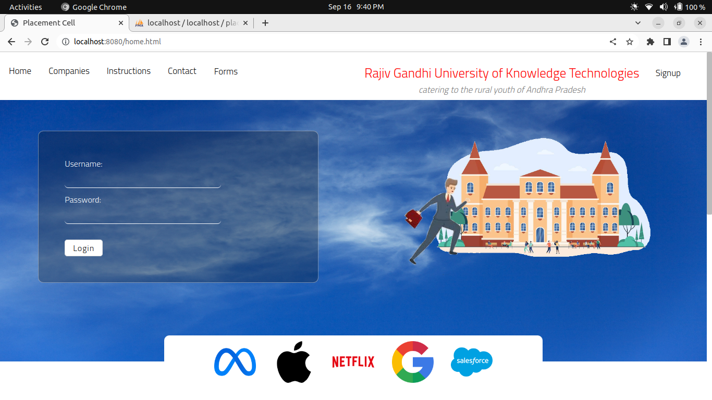
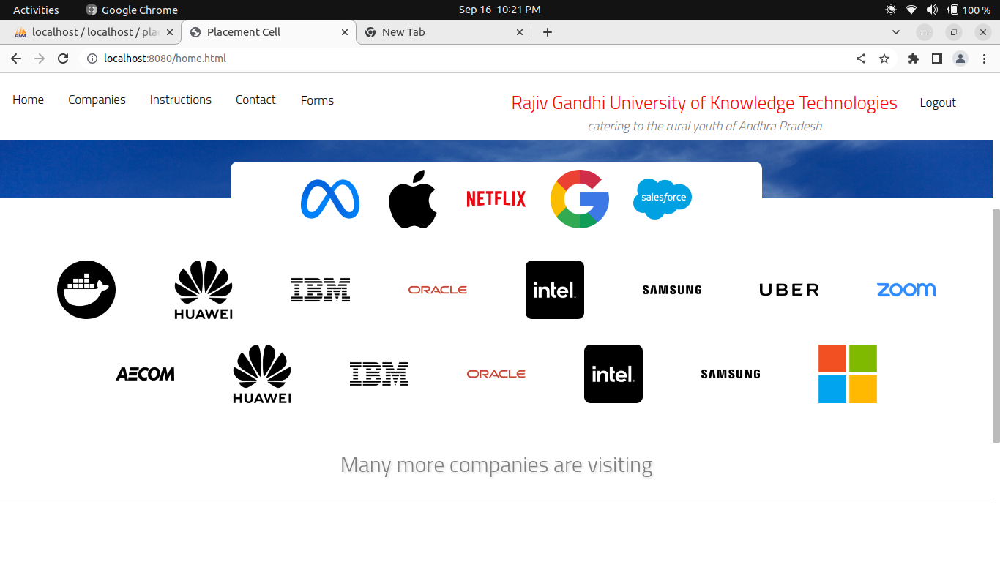
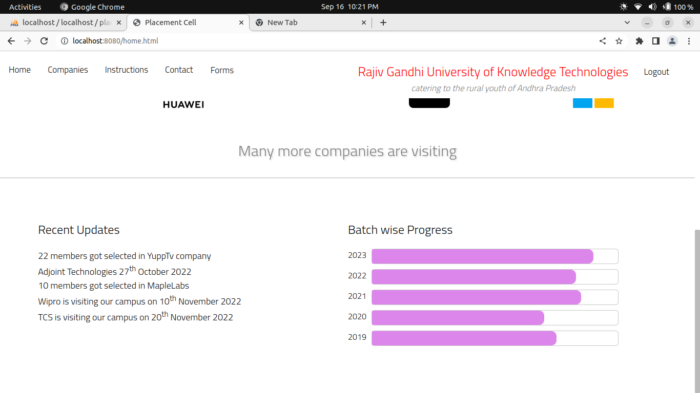
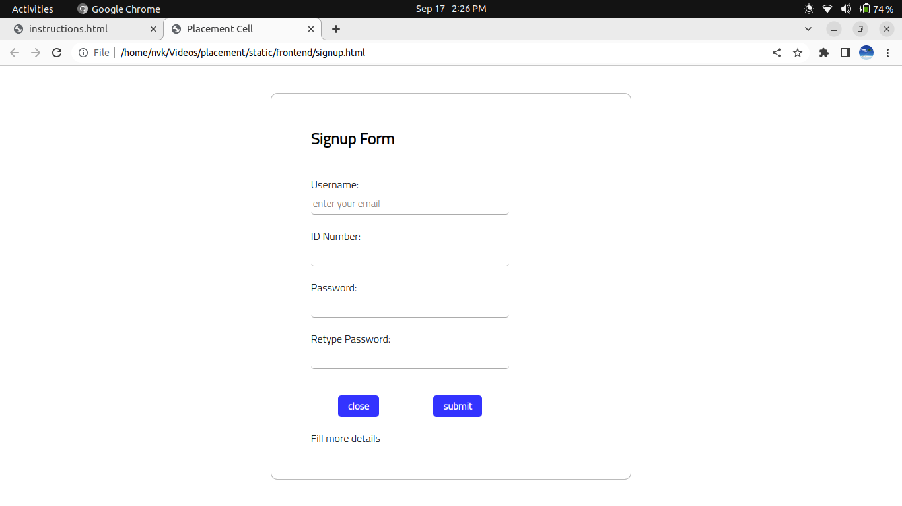
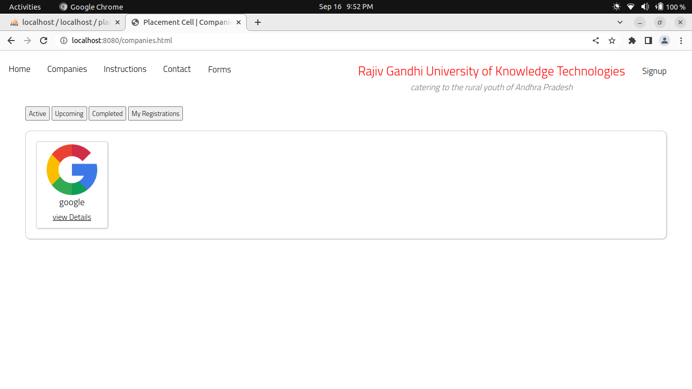
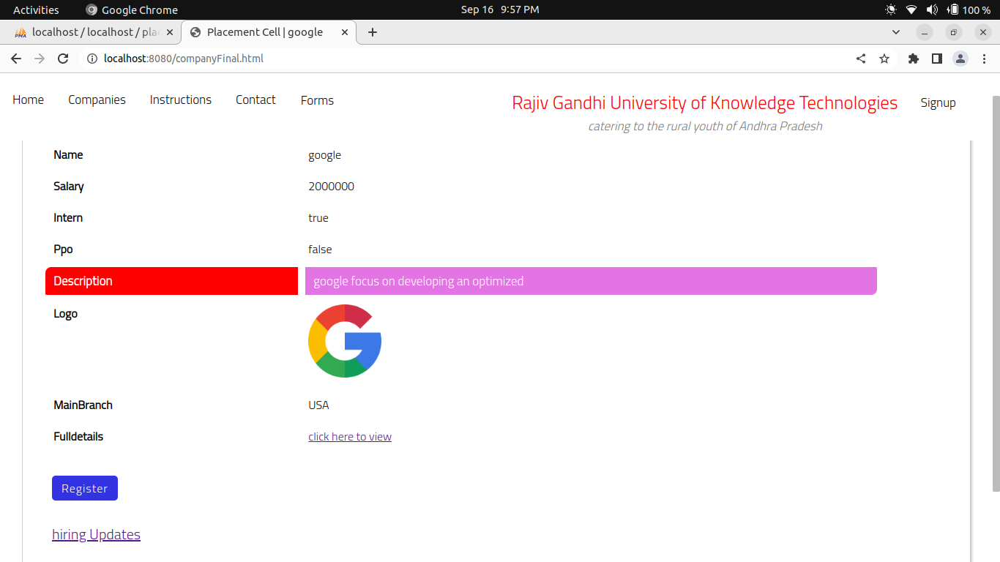
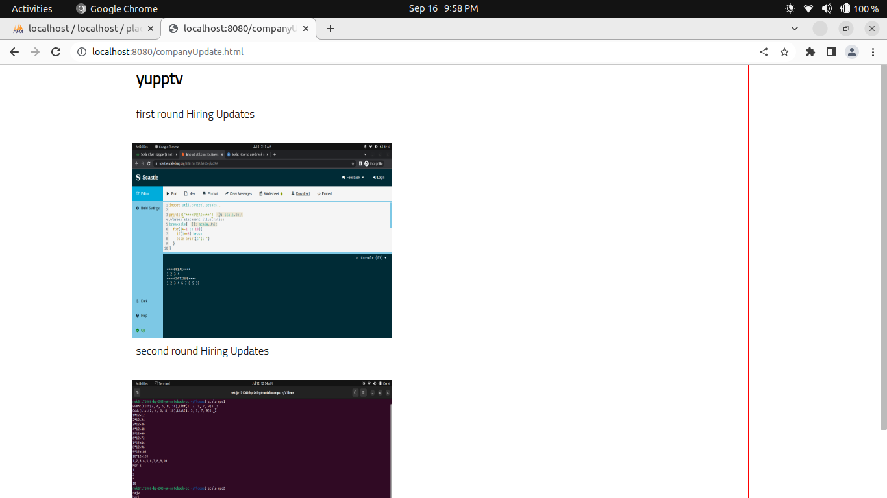
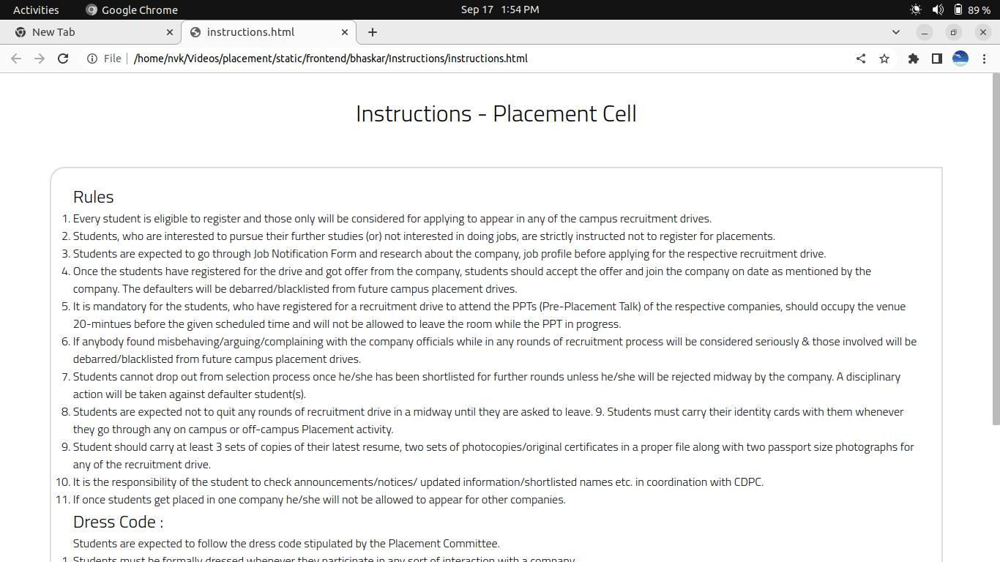
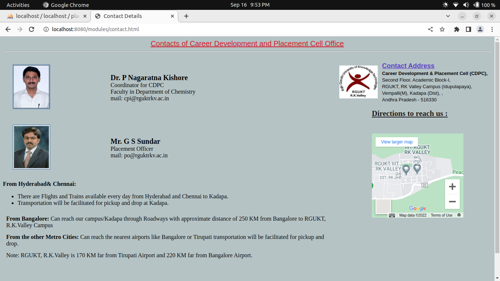

<h1>ShowTime-An OTT platform</h1>
<h2>Tech Stack Used:</h2>
<h3>Frontend:</h3>
<ul>
	<li>HTML</li>
	<li>Css</li>
	<li>JS,DOM</li>
</ul>
<h3>Backend:</h3>
<ul>
	<li>Nodejs</li>
	<li>Expressjs</li>
	<li>Nodemailer for student alerts</li>
	<li>Mysql for Database</li>
</ul>
<i>The project is related to placement cell,where it manages all the
Placement Cell related activities and this will remove the communication gap
between the Placement Cell and students.Students are notified on each and
every update through this website and each student have a flexible
management system.User get the status related to his application to
the company through email.Students also solved their faq’s through
sending queries to the placement officer.Our target is to enhance all
the features and providing a flexible environment to the users.</i>
<h2>Home Page</h2>

<h2>Register Page</h2>

<h2>Companies screen</h2>
<i>List of companies visiting the campus</i>

<h2>Company Details page</h2>
<i>Here you find the details of company</i>

<h2>HiringUpdates Page</h2>
<i>Updates of completed round of each company i.e, Each company conduct many rounds in the hiring process,so for each we can update the students like how many students are shortlisted for this round etc.,</i>

<h2>Instructions page</h2>
<i>Rules of Placement cell</i>

<h2>Contact page</h2>
<i>contact details of placement officers</i>

